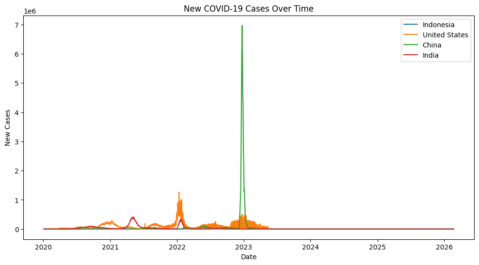
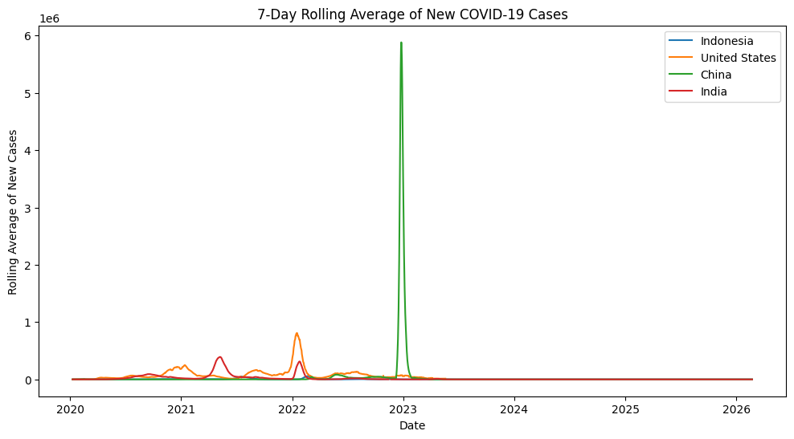
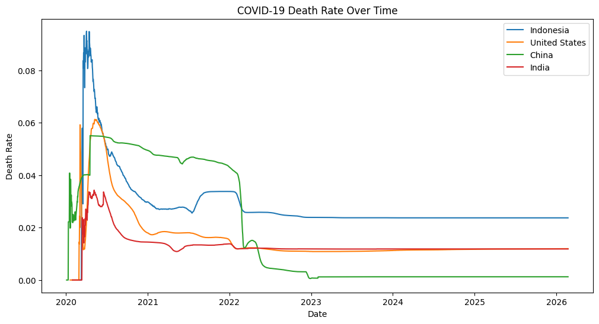
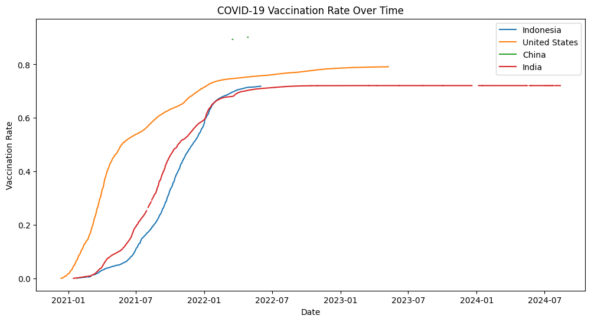
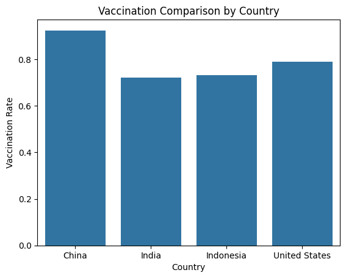
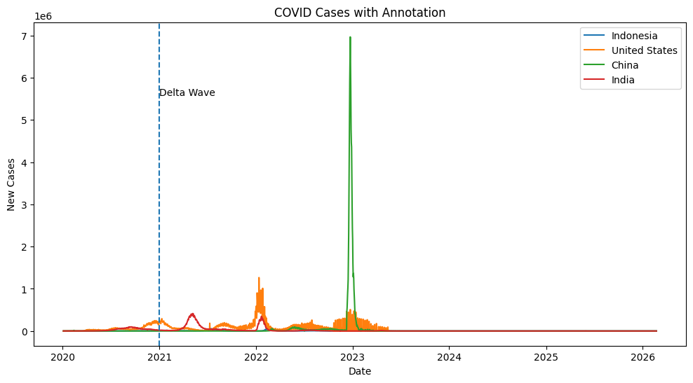
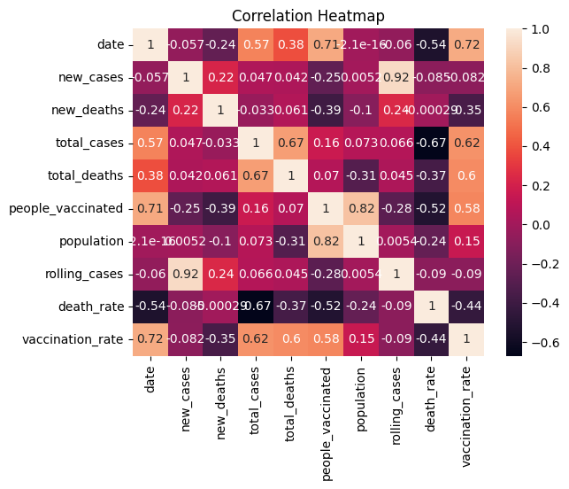

# COVID-19 Multi-Country EDA

Exploratory Data Analysis of COVID-19 trends across **Indonesia, United States, China, and India** — covering case trends, death rates, vaccination progress, and cross-country comparisons using data from [Our World in Data](https://ourworldindata.org/coronavirus).

---

## Repository Structure

```
covid19-eda-multi-country/
│
├── data/
│   └── Covid19Data_Small.csv
│
├── notebook/
│   └── covid19-eda-multi-country-analysis.ipynb
│
├── images/
│   ├── daily_cases_trend.png
│   ├── smoothed_trend_7day.png
│   ├── death_rate_over_time.png
│   ├── vaccination_rate_over_time.png
│   ├── vaccination_comparison_by_country.png
│   ├── event_annotation.png
│   └── correlation_heatmap.png
│
├── requirements.txt
└── README.md
```

---

## Project Overview

This project explores global COVID-19 data to uncover patterns in case trends, fatality rates, and vaccination rollouts across four countries that represent vastly different pandemic experiences and policy responses.

**Countries analyzed:**
- 🇮🇩 Indonesia
- 🇺🇸 United States
- 🇨🇳 China
- 🇮🇳 India

---

## Objectives

- Analyze COVID-19 case trends over time across multiple countries
- Compare pandemic intensity and wave patterns between countries
- Examine how death rates evolved as the pandemic progressed
- Evaluate vaccination rollout speed and final coverage
- Identify correlations between key pandemic variables

---

## Dataset

| Detail | Info |
|---|---|
| **Source** | [Our World in Data – COVID-19](https://ourworldindata.org/coronavirus) |
| **File** | `Covid19Data.csv` |
| **Total rows** | ~570,606 entries |
| **Total columns** | 61 columns |
| **Key columns used** | `country`, `date`, `new_cases`, `new_deaths`, `total_cases`, `total_deaths`, `people_vaccinated`, `population` |

---

## Tools & Libraries

| Library | Purpose |
|---|---|
| `pandas` | Data manipulation and cleaning |
| `matplotlib` | Data visualization |
| `seaborn` | Statistical visualization |

---

## Workflow

### 1. Data Understanding
Initial exploration of the dataset structure, data types, missing values, and basic statistics using `df.head()`, `df.info()`, and `df.describe()`.

### 2. Data Cleaning
- Checked for missing values across all 61 columns
- Selected 8 relevant columns for analysis
- Converted the `date` column to datetime format

### 3. Data Filtering
Filtered the dataset to focus on four countries: **Indonesia, United States, China, and India**.

### 4. Growth Comparison
Calculated average daily new cases per country to get a high-level view of pandemic intensity across the four countries.

### 5. Trend Analysis
Visualized and analyzed:
- Daily new case trends over time
- 7-day rolling average for smoothed trend lines
- Death rate (total deaths / total cases) over time
- Vaccination rate (people vaccinated / population) over time

### 6. Country Comparison
Bar chart comparing the most recent vaccination rates across all four countries.

### 7. Event Annotation
Annotated the case trend chart with a key event marker to connect data patterns to real-world events.

### 8. Correlation Analysis
Heatmap showing correlations between numerical variables including cases, deaths, vaccinations, and population.

---

## Visualizations

### Daily Cases Trend



China (green) recorded the most dramatic single spike in early 2023 following the end of its zero-COVID policy. India (red) peaked sharply in mid-2021 during the Delta wave. Indonesia (blue) and the United States (orange) showed smaller but distinct wave patterns.

---

### Smoothed Trend (7-Day Average)



The 7-day rolling average removes daily noise and confirms the wave patterns more clearly. China's 2023 surge remains the most dominant feature, while the United States shows the most repeated multi-wave structure.

---

### Death Rate Over Time



Indonesia (blue) had the highest death rate in the early pandemic period, likely due to limited testing capacity that caused many cases to go undetected. All countries showed declining death rates over time as healthcare systems adapted and vaccination coverage increased.

---

### Vaccination Rate Over Time



China (green) achieved the highest vaccination rate by end of observation period (~90%+). India (red) showed rapid growth from mid-2021. The United States (orange) had the fastest early rollout but plateaued at a lower final rate. Indonesia (blue) had the slowest start but maintained steady growth.

---

### Vaccination Comparison by Country



Bar chart snapshot of final vaccination rates. China leads, followed by India and Indonesia, with the United States showing the lowest final rate among the four — likely reflecting vaccine hesitancy and plateau effects post-2021.

---

### Event Annotation



Case trend chart annotated with a January 2021 marker. China's 2023 spike (green) is the most prominent feature. India (red) and Indonesia (blue) show visible mid-2021 Delta wave peaks. The United States (orange) stays relatively flat at this scale.

---

### Correlation Heatmap



`total_cases` and `total_deaths` show a strong positive correlation (0.67). `vaccination_rate` shows a negative correlation with `new_cases` (-0.082), indicating that higher vaccination coverage is associated with fewer daily cases. `new_cases` and `new_deaths` are also positively correlated (0.22).

---

## Key Takeaways

- **United States** recorded the highest average daily new cases (~83,890/day), driven by multiple large waves throughout the pandemic timeline.
- **China** experienced the single largest spike in the dataset in early 2023, triggered by the abrupt end of its zero-COVID policy.
- **Indonesia** had the highest early death rate among the four, likely due to limited testing that caused underreporting of cases.
- **China and India** achieved the highest final vaccination rates, while the United States plateaued earlier despite the fastest initial rollout.
- **Vaccination rate** shows a negative correlation with new case counts, providing data-driven support for the effectiveness of vaccination campaigns.
- A **7-day rolling average** is effective at smoothing daily volatility and revealing clearer underlying wave patterns.

---

## Conclusion

This EDA reveals that COVID-19's impact varied dramatically across Indonesia, the United States, China, and India — shaped by differences in policy responses, healthcare infrastructure, population size, and testing capacity.

Indonesia's high early death rate highlights the risk of underdetection in under-resourced settings. China's massive 2023 surge demonstrates the cost of abrupt policy shifts after prolonged containment. The United States showed sustained multi-wave transmission, while India's Delta wave stands out as one of the most severe single surges in this dataset.

Vaccination rollout correlates with reduced transmission, reinforcing its role as a critical pandemic management tool. Future analysis could incorporate government stringency indices, mobility data, or variant-level breakdowns for deeper insights.

---

## How to Run

1. Clone this repository
   ```bash
   git clone https://github.com/yourusername/covid19-eda-multi-country.git
   cd covid19-eda-multi-country
   ```

2. Install dependencies
   ```bash
   pip install -r requirements.txt
   ```

3. Place `Covid19Data_Small.csv` inside the `data/` folder

4. Open the notebook
   ```bash
   jupyter notebook notebook/covid19-eda-multi-country-analysis.ipynb
   ```

---

## 📜 License

This project is for educational and portfolio purposes. Dataset is sourced from [Our World in Data](https://ourworldindata.org/coronavirus) and is publicly available under their terms.
